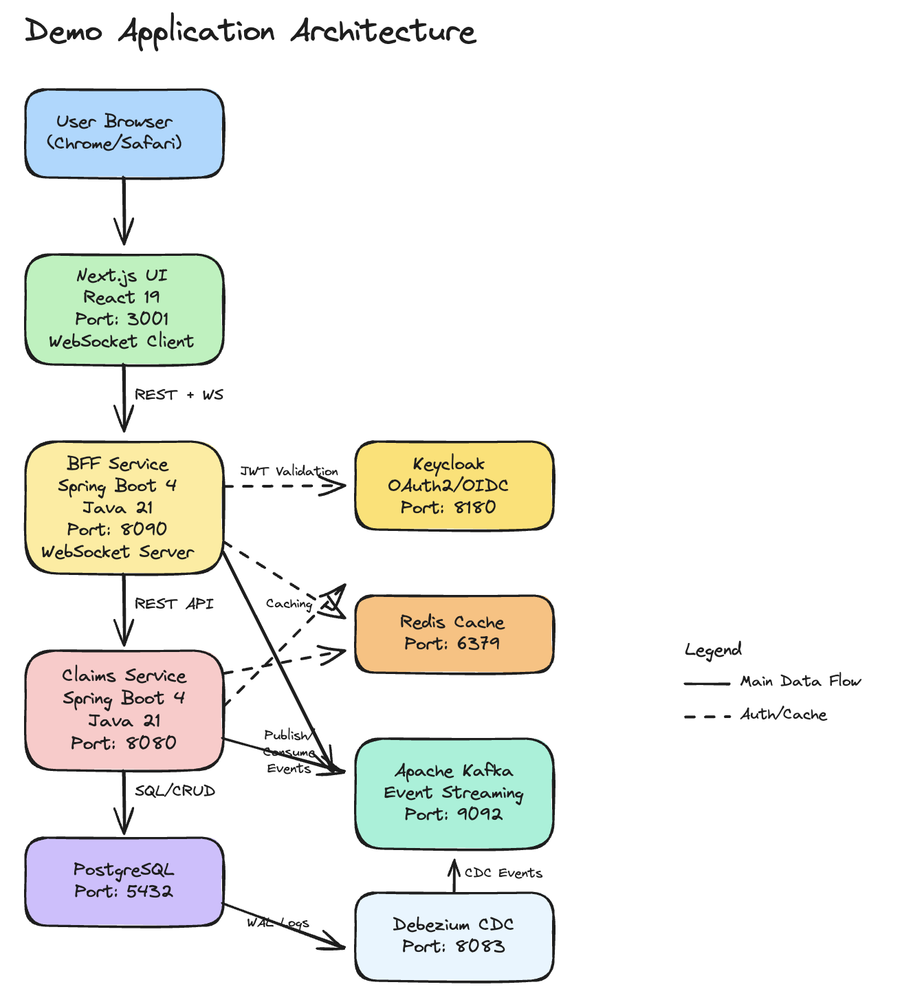

# Demo Application Architecture

## System Overview

A full-stack microservices application demonstrating modern cloud-native patterns: OAuth2 authentication, event-driven architecture via Kafka and CDC, real-time WebSocket updates, and a Backend-for-Frontend (BFF) API gateway.

---

## Architecture Diagram



### Text Diagram

```
┌─────────────────────────────────────────────────────────┐
│                     User / Browser                      │
└──────────────────────────┬──────────────────────────────┘
                           │ HTTP / WebSocket
                           ▼
                 ┌─────────────────┐
                 │   Next.js UI    │  :3001
                 │  React 19       │
                 └────────┬────────┘
                          │ REST API + WebSocket
                          ▼
         ┌────────────────────────────┐
         │        BFF Service         │  :8090
         │      Spring Boot 4         │
         │   (API gateway + WS hub)   │
         └──┬──────────┬──────────┬───┘
            │          │          │
            │ REST     │ Cache    │ OAuth2 JWT
            ▼          ▼          ▼
  ┌──────────────┐ ┌────────┐ ┌──────────┐
  │ Claims Svc   │ │ Redis  │ │ Keycloak │  :8180
  │ Spring Boot 4│ │  :6379 │ │ OAuth2   │
  │     :8080    │ └────────┘ └──────────┘
  └──┬───────────┘
     │ SQL/CRUD
     ▼
┌──────────────┐    WAL     ┌──────────────┐
│  PostgreSQL  │ ─────────► │   Debezium   │  :8083
│    :5432     │            │     CDC      │
└──────────────┘            └──────┬───────┘
                                   │ CDC Events
                                   ▼
                          ┌──────────────────┐
                          │   Apache Kafka   │  :9092
                          │ Event Streaming  │
                          └──────────────────┘
                                   ▲
                    Claims Svc + BFF publish/consume events
```

---

## Component Details

### Frontend — Next.js UI (Port 3001)
- **Framework:** Next.js 16, React 19
- **State:** Zustand
- **API:** Auto-generated TypeScript client from OpenAPI spec
- **Real-time:** WebSocket connection to BFF for live updates
- **Auth:** OAuth2 login flow via Keycloak (browser redirect)

### BFF Service (Port 8090)
- **Purpose:** API gateway and aggregation layer for the UI
- **Technology:** Spring Boot 4, Java 21
- **Responsibilities:**
  - OAuth2 resource server (validates JWT from Keycloak)
  - Proxies and aggregates calls to Claims Service
  - WebSocket hub — pushes real-time events to connected browsers
  - Session/token caching via Redis
  - Publishes and consumes Kafka events

### Claims Service (Port 8080)
- **Purpose:** Core business logic — claims management
- **Technology:** Spring Boot 4, Java 21
- **Responsibilities:**
  - Claims CRUD (PostgreSQL via JPA + Liquibase migrations)
  - User management
  - Dashboard data aggregation
  - Redis caching
  - Kafka event publishing and consumption

---

## Infrastructure

| Component | Port | Purpose |
|-----------|------|---------|
| Keycloak | 8180 | OAuth2/OIDC identity provider. Realm: `demo-app`. Runs dev-mem (H2) — no volume needed. |
| PostgreSQL | 5432 | Primary relational database |
| Redis | 6379 | Distributed cache and session store |
| Apache Kafka | 9092 | Event streaming backbone |
| Zookeeper | 2181 | Kafka cluster coordination |
| Debezium | 8083 | Change Data Capture — monitors PostgreSQL WAL, publishes changes to Kafka |
| Kafka UI | 9093 | Browser UI to browse topics and messages |

---

## Data Flow Patterns

### 1. User Request
```
Browser → Next.js UI → BFF → Claims Service → PostgreSQL
                         ↓
                      Keycloak (JWT validation)
```

### 2. Event-Driven CDC
```
PostgreSQL write → Debezium (WAL) → Kafka → Services consume → WebSocket push → UI
```

### 3. Real-time UI Update
```
Claims Service creates/updates claim
  → publishes Kafka event
    → BFF consumes event
      → pushes via WebSocket
        → Next.js UI re-renders
```

---

## Technology Stack

| Component | Technology | Version |
|-----------|-----------|---------|
| Frontend | Next.js + React | 16.1.6 / 19.2.3 |
| Backend | Spring Boot | 4.0.2 |
| Runtime | Java | 21 |
| Database | PostgreSQL | 15 |
| Cache | Redis | 7 |
| Auth | Keycloak | 26.5.2 |
| Message Broker | Apache Kafka | 7.5.0 (Confluent) |
| CDC | Debezium | 2.4 |

---

## Architecture Patterns

- **Hexagonal (Ports & Adapters):** Both backend services use strict layer separation — domain, application, and adapter layers
- **Backend for Frontend (BFF):** Dedicated API gateway tailored to the UI's needs
- **API-First:** OpenAPI specs are the source of truth; Java DTOs and TypeScript clients are generated from them
- **Event-Driven:** Services communicate asynchronously via Kafka; CDC ensures DB changes also flow as events
- **OAuth2 / OIDC:** All API endpoints are protected; the UI authenticates users via Keycloak

---

## Security Notes

- **Keycloak** runs in `start-dev` mode with an in-memory H2 database. The realm (`demo-app`) is auto-imported from `docker/compose/keycloak/`. Realm config is not persisted to a volume — the JSON file is the source of truth.
- **JWT validation:** Backend services fetch signing keys from Keycloak's internal Docker hostname (`keycloak:8080`). The `iss` claim in tokens is stamped with the browser-facing URL (`localhost:8180`) via `KC_HOSTNAME` configuration.
- **No production hardening** — this is a demo/QA environment. Credentials are intentionally simple.
